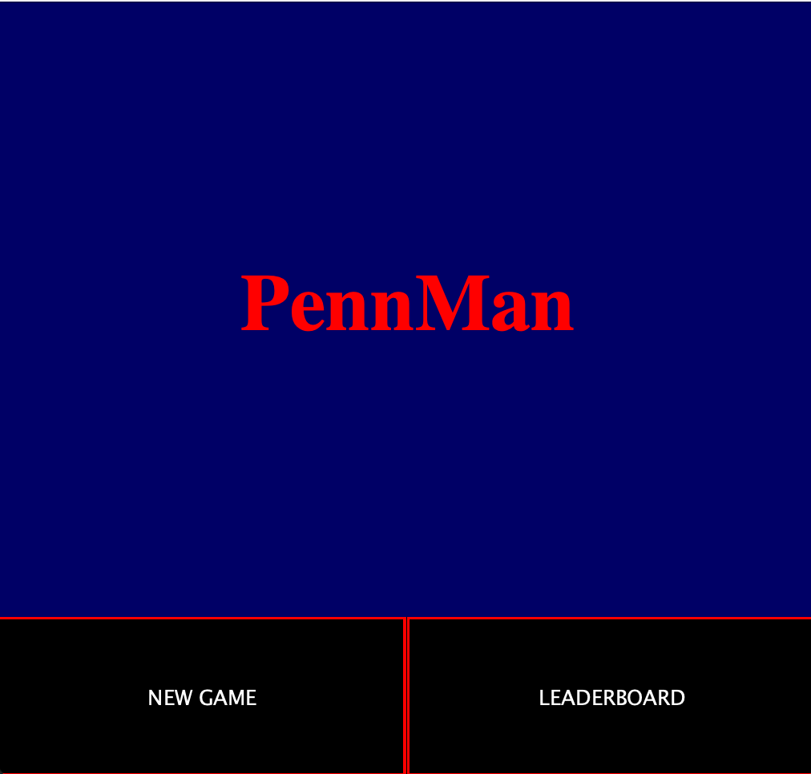
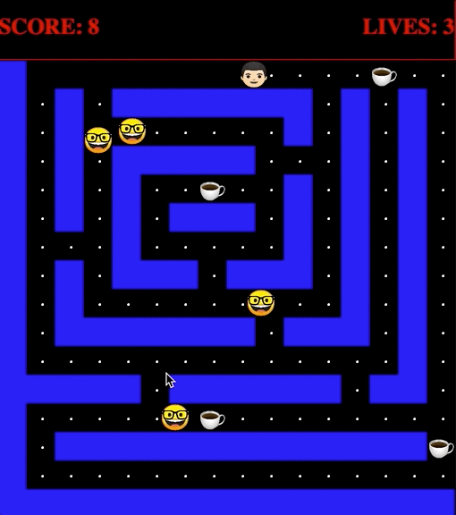
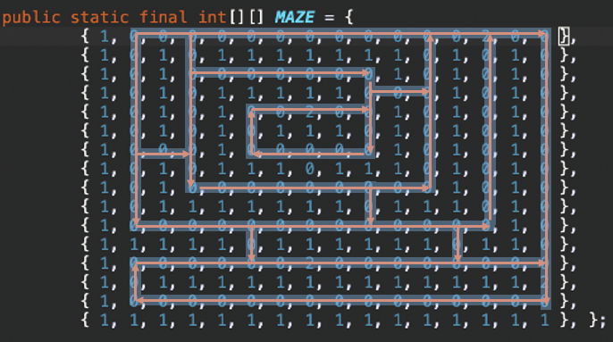

# PennMan

Completed as a final project for CIS 120 

## Description

PennMan is a game similar to Pacman but with a twist. Your main objective is to navigate the student through the maze, collecting all the problem sets (white dots) while avoiding the *evil* TA's. Collecting coffees speeds up movement and makes the TA's vulnerable, similar to the original Pacman. 

## Rules and Objectives
Use arrow keys to move. 

Collect all problem sets (white dots) or blow up all TA's to win. 

Collecting coffees will enter scatter mode for 5 seconds. In scatter mode, game movement 
speed is doubled, and collision with TA's causes them to explode. 

If not in scatter mode, collision with TA's loses a life.

There are 3 lives total. 

## Design

The project consists of  7 classes and a Direction enumeration. 
The enumeration stores 5 directions (UP, DOWN , LEFT, RIGHT, PARALLEL). 

Audio and Image Controller simply handle loading and initializing the audio and video files used for sound effects and animation throughout the game. 

### GameCourt

The GameCourt class handles certain game mechanics such as conditions for winning, losing,
drawing the maze, and animating character movement using a Timer and the tick() method. 

#### Procedure for drawing the maze

A 2D integer array was created denoting x,y positions in the game court. The current maze size is 16x16. 
A 0 is placed to denote a path and a 1 to denote a wall. A 2 denotes a coffee power-up. 

When drawing, we use a standard tile size of 32x32 pixels for each of the 16x16 tiles. Note that the
dimensions of the game court are 512x512 pixels, and 32*16x32*16 = 512x512. This allows for each index
in the 16x16 array correspond to 1 32x32 pixel tile drawn. This makes the drawing and modifying of
mazes very intuitive, and allows for the possibility of creating/auto-generating new mazes.

Note: In order to translate from pixel coordinates to array indices, we can simply find Floor(pixel coordinate / tile size)

### GameObj 

The GameObj class is an abstract class that defines general behaviors for the characters in the 
game. There are currently two types of GameObj's. PennMan and the TA's. 
A majority of GameObj is devoted to defining methods to enable movement throughout the maze while
respecting wall boundaries.

#### Procedure for detecting wall collisions

We first switch on the current direction of travel, as we only need to check for a collision
in that direction. Depending on the direction, we will check the corners of the 32x32 tile closest
to the wall in question to see if they are colliding (i.e if dirTravel is UP, check topLeft and
topRight. If dirTravel is Right, check topRight and bottomRight, etc.). The collision method 
simply returns the direction of the collision and is not involved in actually preventing the 
collision from happening. This is the restrict() functions job. 

Upon collision, the restrict function "snaps" the user to the closest tile, and sets velocity of travel in direction of collision 
to zero. How this is handled depends on the type of GameObj, so this is as specific as it gets
in the gameObj class. 

Note: the SnapX function snaps the x-coordinate to the closest tile. it does this by taking the 
current x-coordinates and finds the closest multiple of 32 (tile size). Similar for snapY. 

#### Procedure for navigating PennMan 

This is handled in the checkPath() method of the Man class. Every time a key is pressed we store it
in the lastPressed Direction variable. We then check if there is currently a path in that 
direction, if so, take it and clear lastPressed. Otherwise, we leave lastPressed as its last set value. That
way we can continuously check in that direction, and if a new key is not pressed before a 
path in that direction becomes available, we will take that path. This allows for lenience in the
timing of the key press from the user when navigating through the maze, and makes it easier to move under pressure.

#### Procedure for navigating TA

This is slightly more complex as it must be done without any user input. 
This is handled by the navigate function in TA. We first check if the TA is in scatter mode. If
so, it is sufficient for the TA's take random paths throughout the maze. They uses the check path
methods from GameObj to do this, but only take any path with probability 0.3. If they are 
not in scatter mode, we  define them as "chasers". The goal is to constantly try and 
minimize our distance from  man. We use the relativeX and relativeY methods to  determine in 
which direction we need to travel in order to get closer to pennMan. If a path becomes available
in the correct direction, we take it, otherwise we continue searching. If a scenario arises where
the TA has no direct path in horizontal OR vertical direction, chaser is switched off until a path
in the relevant direction becomes available. In other words, the TA will wander randomly until a 
path in the correct direction becomes available.

Enjoy!!!
